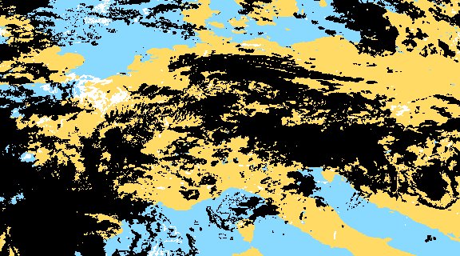

# Welcome! I'm Felix, an atmospheric scientist and mathematician.

  

I study clouds:
* Stratocumulus closed/open cell transitions with a focus on inferring process understanding using statistical methods
* Lagrangian evolution of clouds

Currently I work in the <a href="https://mpimet.mpg.de/en/research/independent-research-groups/multiscale-cloud-physics-lise-meitner-group">"Multiscale Cloud Physics" research group</a> lead by Dr. Franziska Glassmeier at the MPI for Meteorology.

In my PhD I tracked clouds in satellite and model data. This enables an in-depth look into cloud formation and evolution processes by adding an additional dimension of time. For example, we used cloud tracking as a tool for a more detailed comparison between satellite and model data, not only relying on spatially and temporally aggregated data.
